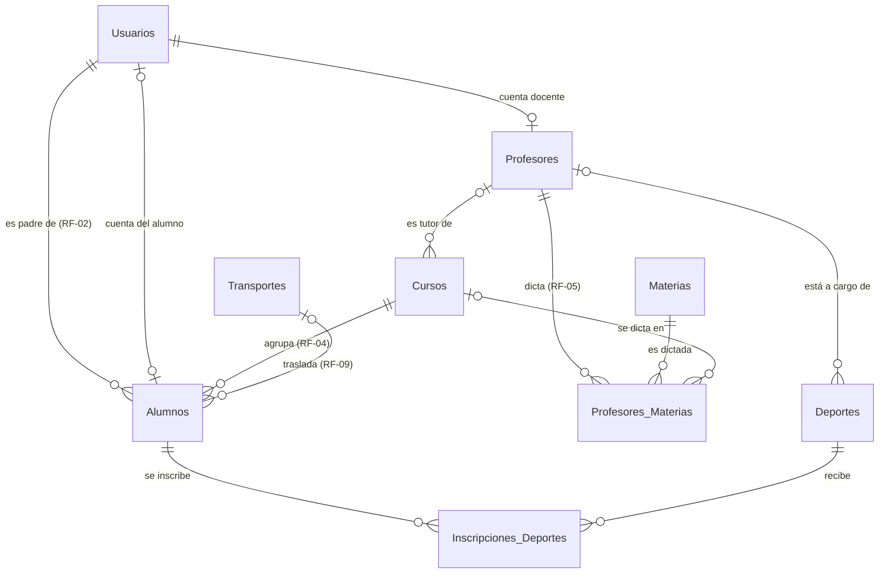

# Educar para Transformar - Plataforma Institucional
[](https://app.codacy.com/gh/ValentinoEBorchichi/Pagina_Web_Educativa/dashboard?utm_source=gh&utm_medium=referral&utm_content=&utm_campaign=Badge_grade)

El presente documento constituye la documentación técnica del sistema integral de gestión desarrollado para el centro educativo «Educar para Transformar». El sistema se diseñó sobre una arquitectura cliente-servidor modular y escalable, orientada a facilitar su mantenimiento y la incorporación progresiva de nuevos módulos.

Proyecto desarrollado en el marco de la Tecnicatura Universitaria en Programación de la Universidad Tecnológica Nacional, Facultad Regional Resistencia (UTN FRRe).

## Tecnologías utilizadas

### Frontend
*   **React 19** + **Vite**: construcción de la interfaz de usuario bajo un modelo de componentes reactivos, con un entorno de desarrollo de compilación rápida.
*   **React Router 7**: gestión de la navegación y de las rutas protegidas.
*   **Context API**: administración del estado global y de la sesión de autenticación.
*   **CSS3 (Vanilla)**: sistema de diseño propio, con enfoque adaptable (*responsive*).

### Backend
*   **Node.js** + **Express**: implementación del servidor de la API REST.
*   **Microsoft SQL Server** (controlador `mssql`): motor de base de datos relacional principal del sistema de gestión (véase la sección *Modelo de base de datos*).
*   **SQLite**: motor de persistencia de los módulos legados cuya migración a SQL Server se encuentra pendiente (véase *Sprint 1 → Convivencia con SQLite*).
*   **JWT (JSON Web Tokens)**: autenticación sin estado y mantenimiento de la sesión del usuario.
*   **bcryptjs**: generación de *hashes* de contraseñas mediante el algoritmo bcrypt.

---

## Instalación y ejecución

El código fuente se encuentra en el directorio `Plataforma_Web_Educativa_ACTIVIDAD3/`, organizado en dos subproyectos independientes: `frontend` y `backend`. Los comandos de esta sección se ejecutan a partir de dicho directorio.

### 1. Configuración del backend
```powershell
cd backend
npm install
node seed.js  # Ejecución única: carga de datos de prueba de los módulos legados (SQLite)
npm run dev
```
*El servidor queda disponible en `http://localhost:3000`. Dado que los módulos de autenticación y de deportes operan sobre SQL Server, deben completarse previamente los pasos descriptos en la sección **Puesta en marcha del backend con SQL Server**.*

### 2. Configuración del frontend
```powershell
cd frontend
npm install
npm run dev
```
*La aplicación queda disponible en `http://localhost:5173`.*

---

## Credenciales de demostración

Para verificar el comportamiento de cada rol y de su panel correspondiente, se dispone de los usuarios que se detallan a continuación. A partir del Sprint 1, la autenticación se valida contra SQL Server (tabla `Usuarios`); las cuentas son creadas por el script `database_schema.sql`.

| Rol | Usuario | Contraseña | Funcionalidad |
| :--- | :--- | :--- | :--- |
| **Administrador** | `admin` | `admin123` | Gestión de preinscripciones y usuarios; inscripción de cualquier alumno en deportes. |
| **Docente** | `docente` | `docente123` | Carga de calificaciones y gestión de agenda. |
| **Alumno** | `alumno` | `alumno123` | Cuenta vinculada al legajo de Benjamín Fernández; inscripción propia en deportes. |
| **Padre** | `padre` | `padre123` | Responsable de los cinco alumnos de prueba; inscripción de sus hijos en deportes. |

---

## Arquitectura del proyecto

Las rutas se expresan en forma relativa al directorio `Plataforma_Web_Educativa_ACTIVIDAD3/`.

*   `backend/src/`: controladores y rutas, organizados por módulo.
*   `backend/src/config/db.js`: *pool* de conexiones a SQL Server; constituye el punto de acceso a datos obligatorio para todo código nuevo.
*   `backend/src/config/auth.js`: *middleware* de autenticación JWT y de control de acceso basado en roles (RF-01).
*   `backend/src/db/`: directorio reservado para la capa de acceso a datos de SQL Server.
*   `backend/database_schema.sql`: script DDL de creación de la base de datos en SQL Server, con inclusión de datos de prueba.
*   `backend/.env`: configuración local con credenciales y secretos; excluido del control de versiones (plantilla disponible en `backend/.env.example`).
*   `backend/database/`: archivo de base de datos SQLite de los módulos legados.
*   `frontend/src/components/`: componentes atómicos y *layouts* reutilizables.
*   `frontend/src/pages/`: vistas principales y paneles específicos de cada rol.
*   `frontend/src/context/`: lógica global de autenticación.

---

## Modelo de base de datos (SQL Server)

El esquema completo se encuentra definido en [`backend/database_schema.sql`](Plataforma_Web_Educativa_ACTIVIDAD3/backend/database_schema.sql). El script crea la base de datos `EducarParaTransformar`, compuesta por nueve tablas vinculadas mediante claves foráneas.



| Tabla | Contenido | Relaciones |
| :--- | :--- | :--- |
| **Usuarios** | Cuentas de acceso al sistema: `username`, `password_hash` (bcrypt), nombre, correo electrónico y `rol` (`admin`, `docente`, `alumno`, `padre`). | Referenciada por `Profesores` y `Alumnos`. |
| **Profesores** | Legajo docente: DNI, especialidad, teléfono y fecha de alta. | `usuario_id` → Usuarios (restringido al rol `docente`). |
| **Cursos** | Nivel (Inicial, Primario o Secundario), grado, división, turno, ciclo lectivo y cupo. | `profesor_tutor_id` → Profesores (opcional). |
| **Materias** | Catálogo de materias: nombre (único), descripción e indicador `activo`. | Referenciada por `Profesores_Materias`. |
| **Profesores_Materias** | Asignación de profesores a materias (relación N a N), con fecha de asignación. | `profesor_id` → Profesores, `materia_id` → Materias, `curso_id` → Cursos (opcional: el valor `NULL` indica que el profesor se encuentra habilitado para la materia sin curso asignado). |
| **Transportes** | Recorridos de transporte escolar (`numero_recorrido` de 1 a 4), con chofer, patente y capacidad. | Referenciada por `Alumnos`. |
| **Deportes** | Actividades deportivas con su horario semanal (`dias_semana`, `hora_inicio`, `hora_fin`) y cupo. | `profesor_id` → Profesores (opcional). |
| **Alumnos** | Legajo del alumno: DNI, nombre, fecha de nacimiento e inscripción al servicio de comedor (`usa_comedor`). | `curso_id` → Cursos, `padre_id` → Usuarios (rol `padre`), `usuario_id` → Usuarios (rol `alumno`, opcional), `transporte_id` → Transportes (opcional). |
| **Inscripciones_Deportes** | Relación N a N entre alumnos y deportes, con fecha de inscripción. | `alumno_id` → Alumnos, `deporte_id` → Deportes. |

### Reglas de negocio implementadas en la base de datos

| Requerimiento | Mecanismo de implementación en el esquema |
| :--- | :--- |
| **RF-01** Roles | Restricción `CHECK` sobre `Usuarios.rol`. Las claves foráneas compuestas `(usuario_id, rol)` impiden asociaciones inconsistentes, como registrar a un usuario docente en calidad de padre. |
| **RF-02** Hijos del padre | El campo `Alumnos.padre_id` es obligatorio y solo admite usuarios con rol `padre`. Los *endpoints* destinados a padres deben filtrar por `padre_id` a fin de exponer únicamente los datos de sus hijos. |
| **RF-04** Un curso por alumno | `Alumnos.curso_id` se define como una única clave foránea obligatoria. |
| **RF-05** Profesores | La tabla `Profesores` se vincula con la cuenta de usuario correspondiente. La asignación a materias (y al curso en que se dictan) se registra en `Profesores_Materias`; adicionalmente, los profesores pueden asignarse como tutores de cursos y como responsables de deportes. Un profesor no puede repetir una materia en un mismo curso y, en cada curso, cada materia es dictada por un único profesor (índice único filtrado). |
| **RF-06** Máximo de 2 deportes | Disparador (*trigger*) `trg_Inscripciones_Deportes_Reglas`, que genera el error **50006**. |
| **RF-07** Sin superposición horaria | El mismo disparador genera el error **50007**. La columna `dias_semana` se representa como una máscara de bits (Lun = 1, Mar = 2, Mié = 4, Jue = 8, Vie = 16, Sáb = 32, Dom = 64; p. ej., Lun + Mié = 5). Se considera que dos deportes se superponen cuando comparten al menos un día y sus franjas horarias se intersecan. |
| **RF-08** Comedor | Columna `Alumnos.usa_comedor`. |
| **RF-09** Transporte | `Alumnos.transporte_id` referencia uno de los cuatro recorridos (`NULL` indica que el alumno no utiliza el servicio). Una restricción `CHECK` impide registrar un quinto recorrido. |
| Cupo de deportes | El mismo disparador genera el error **50008**. |

Asimismo, la eliminación de datos se realiza de forma controlada: la baja de un alumno elimina en cascada sus inscripciones (`ON DELETE CASCADE`), mientras que la baja de un profesor deja sin asignar sus cursos y deportes (`ON DELETE SET NULL`). No es posible eliminar un curso, un recorrido o un deporte que posea alumnos asociados. Para la baja lógica de deportes y usuarios se emplea la columna `activo`.

> Desde Node.js, el código de error de cada regla se obtiene en la propiedad `err.number` (50006, 50007 o 50008). El *endpoint* `POST /api/deportes/inscribir` efectúa las mismas validaciones **antes** de la inserción, con el objetivo de devolver un mensaje descriptivo (HTTP 409); el disparador actúa como última línea de defensa, por ejemplo, ante dos solicitudes de inscripción simultáneas para un mismo alumno.
>
> Las columnas de fecha y hora (`DATETIME2`) se almacenan en **UTC**, dado que el controlador `mssql` las interpreta en dicho huso horario; la conversión a la hora local se realiza en el frontend.

### Datos de prueba (SQL Server)

El script `database_schema.sql` finaliza con la carga de un conjunto de datos de demostración: un administrador, un padre, una cuenta de alumno, dos profesores (con sus respectivas cuentas docentes), tres cursos, tres materias con cuatro asignaciones a profesores, tres deportes, cinco alumnos (hermanos Fernández, hijos del usuario `padre`) y los cuatro recorridos de transporte.

| Usuario | Contraseña | Rol |
| :--- | :--- | :--- |
| `admin` | `admin123` | Administrador. |
| `padre` | `padre123` | Padre de los cinco alumnos. |
| `docente` | `docente123` | Profesora María González: Educación Física en Primario 3° A y Secundario 1° A; responsable de Fútbol y Hockey. |
| `docente2` | `docente123` | Profesor Jorge Pérez: Matemática en Secundario 1° A y habilitado para Ciencias Naturales (sin curso asignado); responsable de Natación. |
| `alumno` | `alumno123` | Benjamín Fernández (cuenta vinculada a su legajo). |

**Identificadores de la demostración** (dado que la base de datos se crea desde cero, los valores son siempre los siguientes):

| Alumnos | Deportes |
| :--- | :--- |
| 1 Valentina · 2 Lucía · 3 Mateo · 4 Sofía · 5 Benjamín | 1 Fútbol (Lun y Mié 16:00–17:30) · 2 Hockey (Mié 17:00–18:30) · 3 Natación (Mar y Jue 16:00–17:00) |

**Escenario de verificación de las reglas de negocio:**
*   Inscripción de **Lucía** en Hockey → rechazada por **RF-06** (ya se encuentra inscripta en Fútbol y Natación).
*   Inscripción de **Mateo** en Hockey → rechazada por **RF-07** (Fútbol y Hockey se superponen los miércoles entre las 17:00 y las 17:30).
*   Inscripción de **Benjamín** en Hockey → inscripción exitosa (puede ser realizada por el propio alumno mediante la cuenta `alumno`).

Para restablecer el escenario a su estado inicial, se debe ejecutar nuevamente el script `database_schema.sql` (paso 2 de la sección siguiente).

---

## Puesta en marcha del backend con SQL Server

> **Estado actual:** los módulos de autenticación y de deportes (Sprint 1), así como los de padres, transporte y registro docente (Sprint 2), operan sobre SQL Server. Los módulos restantes continúan sobre SQLite hasta completar su migración (véase *Sprint 1 → Convivencia con SQLite*).

**Requisitos:** Node.js 18 o superior, SQL Server 2016 o superior (ediciones Express o Developer) y `sqlcmd` o SQL Server Management Studio (SSMS).

**1. Preparación de SQL Server** (configuración única)
*   En *SQL Server Configuration Manager* → *Configuración de red de SQL Server* → *Protocolos de MSSQLSERVER*, habilitar el protocolo **TCP/IP** y reiniciar el servicio. Esta configuración es necesaria debido a que el controlador `mssql` establece la conexión exclusivamente mediante TCP.
*   Habilitar el modo de autenticación mixto (**SQL Server y Windows**) desde SSMS: *Propiedades del servidor → Seguridad*.

**2. Creación de la base de datos**

Desde la raíz del repositorio, ejecutar:
```powershell
cd Plataforma_Web_Educativa_ACTIVIDAD3/backend
sqlcmd -S localhost -E -C -b -f 65001 -i database_schema.sql
```
*El parámetro `-E` establece la conexión mediante autenticación de Windows, con el usuario de la sesión actual. Como alternativa, es posible abrir y ejecutar el script desde SSMS.*

> **Advertencia:** el script **elimina y vuelve a crear** las tablas, por lo que no debe ejecutarse sobre una base de datos que contenga información real.

**3. Creación de un inicio de sesión (*login*) para la aplicación** (con permisos restringidos a la lectura y escritura de datos, sin privilegios administrativos)
```sql
CREATE LOGIN ept_app WITH PASSWORD = 'UnaClaveSegura123!';
GO
USE EducarParaTransformar;
CREATE USER ept_app FOR LOGIN ept_app;
ALTER ROLE db_datareader ADD MEMBER ept_app;
ALTER ROLE db_datawriter ADD MEMBER ept_app;
```
*La contraseña del ejemplo debe reemplazarse por una clave propia.*

**4. Configuración de las variables de entorno:** copiar el archivo `backend/.env.example` como `backend/.env` y completar los valores de `DB_USER`, `DB_PASSWORD` y `JWT_SECRET`. Este último debe contener una cadena aleatoria y es obligatorio para el inicio del servidor; el archivo `.env.example` describe el procedimiento para generarla. En caso de utilizar una instancia con nombre, definir además la variable `DB_INSTANCE` con el nombre correspondiente (p. ej., `DB_INSTANCE=SQLEXPRESS`). El archivo `.env` se encuentra incluido en `.gitignore` y, por lo tanto, **no debe** incorporarse al repositorio.

**5. Instalación de dependencias e inicio del servidor**
```powershell
npm install
npm run dev     # entorno de desarrollo (nodemon)
npm start       # entorno de producción
```

**6. Verificación de la conexión a SQL Server**
```powershell
node -e "const db = require('./src/config/db'); db.getPool().then(() => console.log('OK')).catch(e => console.error(e.message)).finally(() => db.closePool())"
```
La salida esperada es `Conectado a SQL Server (localhost / EducarParaTransformar).`, seguida de `OK`.

---

## Sprint 1 — Autenticación y deportes (Responsable: Valentino Borchichi)

**Alcance:** **RF-01** (control de acceso basado en roles), **RF-06** (máximo de dos deportes por alumno) y **RF-07** (ausencia de superposición horaria). La totalidad del código desarrollado en este sprint accede a SQL Server mediante el módulo `src/config/db.js`.

### RF-01: autenticación basada en roles (`src/config/auth.js`)

*   `POST /api/auth/login` valida las credenciales del usuario (la contraseña, mediante bcrypt) contra la tabla `Usuarios` y, en caso de éxito, emite un **JWT** firmado con `JWT_SECRET`, con una validez de 30 minutos (coincidente con el tiempo de cierre de sesión por inactividad definido en el frontend). Las cuentas con `activo = 0` no pueden iniciar sesión.
*   Cada ruta protegida aplica el *middleware* `requireAuth(roles)`:
    ```js
    const { requireAuth } = require('../config/auth');
    router.post('/inscribir', requireAuth(['admin', 'padre', 'alumno']), controller.inscribir);
    router.get('/me', requireAuth(), controller.getMe);   // cualquier usuario autenticado
    ```
*   Las solicitudes sin token, o con un token vencido o inválido, reciben la respuesta **401**; las realizadas con un rol no autorizado, la respuesta **403**. Si una ruta declara un rol inexistente, el servidor no se inicia, lo que permite detectar el error de configuración de manera temprana.
*   El *middleware* protege la totalidad de las rutas, incluidas las pertenecientes a los módulos legados.

### Endpoints

| Método | Ruta | Roles | Descripción |
| :--- | :--- | :--- | :--- |
| `POST` | `/api/auth/login` | Público | Inicio de sesión. Respuesta: `{ token, user: { id, username, nombre, rol } }`. |
| `POST` | `/api/auth/registro` | Público | Registro de una cuenta familiar (rol `padre`); el correo electrónico se utiliza como nombre de usuario. |
| `GET` | `/api/auth/me` | Autenticado | Datos del usuario asociado al token. |
| `GET` | `/api/auth/padres` | Autenticado | Listado de usuarios activos con rol `padre`. |
| `GET` / `POST` | `/api/auth/users` | admin | Listado y alta de usuarios con cualquier rol. |
| `PUT` | `/api/auth/users/:id/rol` | admin | Modificación del rol. Si el usuario posee legajos asociados (p. ej., un padre con hijos registrados), la respuesta es 409. |
| `DELETE` | `/api/auth/users/:id` | admin | Eliminación de un usuario sin legajos asociados. |
| `POST` | `/api/deportes/inscribir` | admin, padre, alumno | Inscripción de un alumno en un deporte, con validación de RF-06 y RF-07. |

### `POST /api/deportes/inscribir`

**Cuerpo de la solicitud:** `{ "alumno_id": 5, "deporte_id": 2 }`
*   **admin:** puede inscribir a cualquier alumno.
*   **padre:** puede inscribir únicamente a sus hijos (RF-02).
*   **alumno:** puede inscribirse únicamente a sí mismo; el campo `alumno_id` es opcional, ya que se utiliza el legajo vinculado a la cuenta.

**Respuesta exitosa (201):**
```json
{
  "message": "Inscripción confirmada: Benjamín en Hockey",
  "inscripcion": { "id": 5, "alumno_id": 5, "deporte_id": 2, "deporte": "Hockey",
                   "horario": "Mié 17:00 a 18:30", "fecha_inscripcion": "2026-09-15T04:33:24.000Z" }
}
```

**Respuestas de error:** todas presentan la estructura `{ "message": "...", "codigo": "..." }`. El campo `message` está destinado a mostrarse directamente al usuario, mientras que `codigo` permite al frontend determinar el tratamiento correspondiente.

| HTTP | `codigo` | Condición |
| :--- | :--- | :--- |
| 400 | `DATOS_INVALIDOS` | Ausencia de `alumno_id` o `deporte_id`, o valores que no corresponden a enteros positivos. |
| 401 | — | Solicitud sin token, o con un token vencido o inválido. |
| 403 | — | El rol no posee permiso de inscripción (p. ej., docente). |
| 403 | `SIN_PERMISO` | Un padre intenta inscribir a un alumno que no es su hijo, o un alumno intenta inscribir a otra persona. |
| 403 | `SIN_LEGAJO` | La cuenta de alumno no se encuentra vinculada a un legajo. |
| 404 | `ALUMNO_NO_ENCONTRADO` / `DEPORTE_NO_ENCONTRADO` | El identificador indicado no existe. |
| 409 | `YA_INSCRIPTO` | El alumno ya se encuentra inscripto en el deporte. |
| 409 | `RF-06` | El alumno ya posee dos deportes. La respuesta incluye el campo `deportes_actuales`. |
| 409 | `RF-07` | El horario se superpone con el de otro deporte del alumno. La respuesta incluye el campo `deporte_en_conflicto`. |
| 409 | `SIN_CUPO` / `DEPORTE_INACTIVO` | El deporte no dispone de cupo o se encuentra desactivado. |

Ejemplo de respuesta ante un incumplimiento de RF-07:
```json
{ "message": "El horario de Hockey (Mié 17:00 a 18:30) se superpone con Fútbol (Lun y Mié 16:00 a 17:30), otro deporte de Mateo.",
  "codigo": "RF-07", "deporte_en_conflicto": "Fútbol" }
```

**Estrategia de validación:** el controlador consulta la base de datos (datos del deporte, inscripciones vigentes del alumno y cupo disponible) y, ante un incumplimiento, responde con el mensaje correspondiente antes de efectuar la inserción. En el caso de que dos solicitudes concurrentes superen dicha validación de forma simultánea, el disparador de la base de datos rechaza la inscripción excedente y la API responde igualmente con el código 409.

### Guion de demostración (PowerShell)

Con el servidor en ejecución (`npm run dev`) y la base de datos recién creada, es posible reproducir el escenario de verificación mediante el siguiente script:

```powershell
$api = 'http://localhost:3000'

function Entrar($usuario, $clave) {
    $body = @{ username = $usuario; password = $clave } | ConvertTo-Json
    (Invoke-RestMethod -Method Post -Uri "$api/api/auth/login" -ContentType 'application/json' -Body $body).token
}

function Inscribir($token, $alumnoId, $deporteId) {
    $body = @{ alumno_id = $alumnoId; deporte_id = $deporteId } | ConvertTo-Json
    try {
        Invoke-RestMethod -Method Post -Uri "$api/api/deportes/inscribir" -ContentType 'application/json' `
            -Headers @{ Authorization = "Bearer $token" } -Body $body
    } catch { $_.ErrorDetails.Message }
}

$padre = Entrar 'padre' 'padre123'
Inscribir $padre 2 2   # Lucía -> Hockey: 409 RF-06
Inscribir $padre 3 2   # Mateo -> Hockey: 409 RF-07
$alumno = Entrar 'alumno' 'alumno123'
Inscribir $alumno 5 2  # Benjamín -> Hockey: 201
```

### Convivencia con SQLite (etapa transitoria)

Los módulos académico, de actividades, de comunicación, financiero, de preinscripción, de reportes y de servicios continúan utilizando SQLite (`src/config/database.js`) hasta su migración. Si bien ya incorporan el nuevo *middleware* de autenticación, **el identificador del usuario autenticado corresponde actualmente al de SQL Server** y no coincide con el de la tabla `users` de SQLite. En consecuencia, hasta completar la migración, las siguientes funcionalidades legadas que dependen de dicho identificador no se consideran confiables:
*   **Panel del padre:** consulta de hijos, vinculación y desvinculación de hijos, resumen, pagos y saldo.
*   **Actividades extracurriculares del alumno:** inscripción, consulta y cancelación de inscripciones.
*   **Alta de alumnos por parte del administrador:** el listado de padres devuelve actualmente identificadores de SQL Server.

Por este motivo, dichos módulos constituyen los candidatos prioritarios para la migración a SQL Server. Todo código nuevo debe utilizar `src/config/db.js`.

---

## Sprint 2 — Padres, transporte y registro docente (Responsable: Sebastián Flores)

**Alcance:** **RF-02** (vista de los hijos asociados a cada padre), **RF-09** (logística de transporte escolar obligatorio) y **RF-05** (registro docente y asignación a materias/cursos). La totalidad del código desarrollado en este sprint accede a SQL Server mediante el módulo `src/config/db.js` y protege sus rutas con el *middleware* `requireAuth` definido en `src/config/auth.js` (Sprint 1).

### RF-02: vista de padres (`src/controllers/padres.controller.js`)

El *endpoint* `GET /api/padres/mis-hijos` obtiene el identificador del padre **exclusivamente del token JWT** (`req.user.id`, correspondiente al `Usuarios.id` con rol `padre`) y nunca de parámetros provistos por el cliente. En consecuencia, la consulta se filtra por `Alumnos.padre_id` y resulta imposible solicitar los hijos de otro padre. La respuesta incorpora, para cada alumno, los datos de su curso y del recorrido de transporte asignado (si utiliza el servicio).

### RF-09: logística de transporte (`src/controllers/transporte.controller.js`)

El *endpoint* `POST /api/transporte/inscribir` asocia a un alumno con uno de los cuatro recorridos habilitados, registrando `Alumnos.transporte_id`. **La validación del recorrido es estricta:** el campo `numero_recorrido` debe corresponder exactamente a uno de los valores permitidos (1, 2, 3 o 4); en caso contrario, la solicitud se rechaza con HTTP **400** (`RECORRIDO_INVALIDO`), sin acceder a la base de datos. La restricción `CHECK` del esquema actúa como última línea de defensa. Adicionalmente, se verifica la capacidad del recorrido antes de confirmar la inscripción.

### RF-05: registro docente (`src/controllers/profesores.controller.js`)

Dos operaciones reservadas al administrador:
*   `POST /api/profesores` da de alta el legajo docente (tabla `Profesores`) a partir de una cuenta de usuario existente. La clave foránea compuesta `(usuario_id, usuario_rol)` garantiza que la cuenta exista y posea rol `docente`; de lo contrario, la respuesta es **409** (`USUARIO_INVALIDO`).
*   `POST /api/profesores/asignar` vincula al profesor con una materia y, opcionalmente, con un curso (tabla `Profesores_Materias`). El valor `curso_id` nulo habilita al profesor para la materia sin asignarle todavía un curso. Los índices únicos del esquema impiden asignaciones duplicadas y que, en un mismo curso, una materia sea dictada por más de un profesor (respuesta **409**, `YA_ASIGNADO`).

### Endpoints

| Método | Ruta | Roles | Descripción |
| :--- | :--- | :--- | :--- |
| `GET` | `/api/padres/mis-hijos` | padre | Listado de los alumnos vinculados al padre autenticado, con su curso y recorrido de transporte. |
| `POST` | `/api/transporte/inscribir` | admin, padre, alumno | Inscripción de un alumno en uno de los cuatro recorridos, con validación estricta del recorrido (RF-09). |
| `POST` | `/api/profesores` | admin | Alta del legajo docente sobre una cuenta con rol `docente` (RF-05). |
| `POST` | `/api/profesores/asignar` | admin | Asignación de un profesor a una materia y, opcionalmente, a un curso (RF-05). |

### `GET /api/padres/mis-hijos`

No requiere cuerpo. El identificador del padre se toma del token.

**Respuesta exitosa (200):**
```json
{
  "total": 1,
  "hijos": [
    {
      "id": 5, "dni": "49111223", "nombre": "Benjamín", "apellido": "Fernández",
      "fecha_nacimiento": "2014-03-20", "usa_comedor": false,
      "curso": { "id": 3, "nivel": "Secundario", "grado": 1, "division": "A",
                 "turno": "Mañana", "ciclo_lectivo": 2026 },
      "transporte": null
    }
  ]
}
```

### `POST /api/transporte/inscribir`

**Cuerpo de la solicitud:** `{ "alumno_id": 5, "numero_recorrido": 1 }`
*   **admin:** puede inscribir a cualquier alumno.
*   **padre:** puede inscribir únicamente a sus hijos (RF-02).
*   **alumno:** puede inscribirse únicamente a sí mismo; el campo `alumno_id` es opcional, ya que se utiliza el legajo vinculado a la cuenta.

**Respuesta exitosa (201):**
```json
{
  "message": "Inscripción al transporte confirmada: Benjamín en Recorrido Norte",
  "inscripcion": { "alumno_id": 5, "transporte_id": 1, "numero_recorrido": 1,
                   "recorrido": "Recorrido Norte" }
}
```

**Respuestas de error** (estructura `{ "message": "...", "codigo": "..." }`):

| HTTP | `codigo` | Condición |
| :--- | :--- | :--- |
| 400 | `RECORRIDO_INVALIDO` | `numero_recorrido` ausente o distinto de 1, 2, 3 o 4. La respuesta incluye el campo `recorridos_permitidos`. |
| 400 | `DATOS_INVALIDOS` | Ausencia de `alumno_id`, o valor que no corresponde a un entero positivo (roles admin y padre). |
| 401 | — | Solicitud sin token, o con un token vencido o inválido. |
| 403 | — | El rol no posee permiso de inscripción (p. ej., docente). |
| 403 | `SIN_PERMISO` / `SIN_LEGAJO` | Un padre intenta inscribir a un alumno que no es su hijo, un alumno intenta inscribir a otra persona, o la cuenta de alumno no se encuentra vinculada a un legajo. |
| 404 | `ALUMNO_NO_ENCONTRADO` / `RECORRIDO_NO_ENCONTRADO` | El alumno o el recorrido indicado no existe. |
| 409 | `YA_INSCRIPTO` / `SIN_CUPO` | El alumno ya viaja en ese recorrido, o el recorrido no dispone de cupo. |

### `POST /api/profesores` y `POST /api/profesores/asignar`

**Alta del legajo (`POST /api/profesores`):** `{ "usuario_id": 4, "dni": "20111222", "especialidad": "Educación Física", "telefono": "3624111111" }`. Los campos `especialidad` y `telefono` son opcionales; el DNI debe contener 7 u 8 dígitos numéricos.

**Asignación (`POST /api/profesores/asignar`):** `{ "profesor_id": 1, "materia_id": 2, "curso_id": 3 }`. El campo `curso_id` es opcional (`null` habilita la materia sin curso).

| HTTP | `codigo` | Condición |
| :--- | :--- | :--- |
| 400 | `DATOS_INVALIDOS` | Identificadores ausentes o no válidos, o DNI con formato incorrecto. |
| 401 / 403 | — | Solicitud sin token válido, o realizada por un rol distinto de `admin`. |
| 409 | `YA_EXISTE` | Ya existe un profesor con ese usuario o DNI. |
| 409 | `USUARIO_INVALIDO` | La cuenta indicada no existe o no posee rol `docente`. |
| 409 | `YA_ASIGNADO` | La asignación ya existe, o la materia ya está asignada a otro profesor en ese curso. |
| 409 | `RELACION_INEXISTENTE` | El profesor, la materia o el curso indicado no existe. |

### Guion de demostración (PowerShell)

Con el servidor en ejecución (`npm run dev`) y la base de datos recién creada:

```powershell
$api = 'http://localhost:3000'

function Entrar($usuario, $clave) {
    $body = @{ username = $usuario; password = $clave } | ConvertTo-Json
    (Invoke-RestMethod -Method Post -Uri "$api/api/auth/login" -ContentType 'application/json' -Body $body).token
}

# RF-02: el padre consulta a sus cinco hijos.
$padre = Entrar 'padre' 'padre123'
Invoke-RestMethod -Uri "$api/api/padres/mis-hijos" -Headers @{ Authorization = "Bearer $padre" }

# RF-09: inscripción de Benjamín en el Recorrido Norte (201) y recorrido inválido (400).
$body = @{ alumno_id = 5; numero_recorrido = 1 } | ConvertTo-Json
Invoke-RestMethod -Method Post -Uri "$api/api/transporte/inscribir" -ContentType 'application/json' `
    -Headers @{ Authorization = "Bearer $padre" } -Body $body
try {
    $malo = @{ alumno_id = 5; numero_recorrido = 9 } | ConvertTo-Json
    Invoke-RestMethod -Method Post -Uri "$api/api/transporte/inscribir" -ContentType 'application/json' `
        -Headers @{ Authorization = "Bearer $padre" } -Body $malo
} catch { $_.ErrorDetails.Message }   # 400 RECORRIDO_INVALIDO

# RF-05: el administrador asigna al profesor 2 (Jorge Pérez) la materia Ciencias Naturales en el curso 2.
$admin = Entrar 'admin' 'admin123'
$asig = @{ profesor_id = 2; materia_id = 3; curso_id = 2 } | ConvertTo-Json
Invoke-RestMethod -Method Post -Uri "$api/api/profesores/asignar" -ContentType 'application/json' `
    -Headers @{ Authorization = "Bearer $admin" } -Body $asig
```

---

## Funcionalidades destacadas
*   **Página de inicio modular:** secciones institucionales con animaciones de entrada.
*   **Preinscripción en línea:** formulario con validación de datos y persistencia en la base de datos.
*   **Autenticación mediante JWT:** protección de rutas según el rol del usuario.
*   **Inscripción a deportes:** límite de dos deportes por alumno y control de superposición horaria, validados tanto en la API como en la base de datos.
*   **Paneles personalizados:** vistas y funcionalidades diferenciadas según el tipo de usuario.
*   **Diseño adaptable (*responsive*):** navegación optimizada para dispositivos móviles, tabletas y equipos de escritorio.

---

## Integrantes

*   Valentino Borchichi
*   Sebastián Flores

---
© 2026 Educar para Transformar. Todos los derechos reservados.
