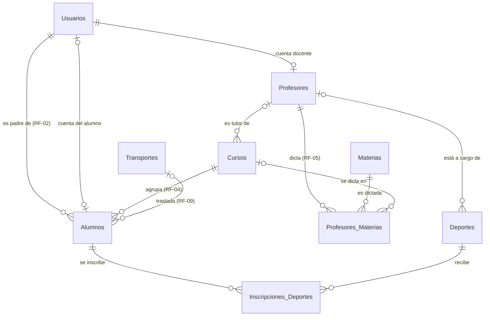

# Educar para Transformar - Plataforma Institucional
[](https://app.codacy.com/gh/ValentinoEBorchichi/Pagina_Web_Educativa/dashboard?utm_source=gh&utm_medium=referral&utm_content=&utm_campaign=Badge_grade)

Sistema integral de gestión para el centro educativo "Educar para Transformar", desarrollado con una arquitectura moderna, modular y escalable.

## 🚀 Tecnologías Utilizadas

### Frontend
*   **React 19** + **Vite**: Interfaz de usuario rápida y reactiva.
*   **React Router 7**: Gestión de navegación y rutas protegidas.
*   **Context API**: Manejo de estado global y autenticación.
*   **CSS3 (Vanilla)**: Sistema de diseño personalizado, responsive y moderno.

### Backend
*   **Node.js** + **Express**: Servidor robusto para la API REST.
*   **Microsoft SQL Server** (driver `mssql`): Base de datos relacional del ERP (ver sección *Modelo de Base de Datos*).
*   **SQLite**: Base de datos de los módulos legados que todavía no migraron a SQL Server (ver *Sprint 1 → Convivencia*).
*   **JWT (JSON Web Tokens)**: Autenticación segura y persistencia de sesión.
*   **Bcryptjs**: Cifrado de contraseñas de alta seguridad.

---

## 🛠️ Instalación y Ejecución

El proyecto se divide en dos carpetas principales: `frontend` y `backend`.

### 1. Configuración del Backend
```powershell
cd backend
npm install
node seed.js  # Solo la primera vez: datos de prueba de los módulos legados (SQLite)
npm run dev
```
*El servidor correrá en `http://localhost:3000`. El login y los deportes usan SQL Server: primero seguí los pasos de **Cómo levantar el servidor Backend (con SQL Server)**.*

### 2. Configuración del Frontend
```powershell
cd frontend
npm install
npm run dev
```
*La aplicación estará disponible en `http://localhost:5173`*

---

## 🔑 Credenciales de Demo

Para probar los diferentes roles y dashboards, utilice los siguientes usuarios. Desde el Sprint 1 el login se valida contra SQL Server (tabla `Usuarios`); estas cuentas las crea `database_schema.sql`.

| Rol | Usuario | Contraseña | Funcionalidad |
| :--- | :--- | :--- | :--- |
| **Administrador** | `admin` | `admin123` | Gestión de preinscripciones y usuarios; inscribe a cualquier alumno en deportes |
| **Docente** | `docente` | `docente123` | Carga de notas y agenda |
| **Alumno** | `alumno` | `alumno123` | Cuenta de Benjamín Fernández; se inscribe a deportes |
| **Padre** | `padre` | `padre123` | Padre de los 5 alumnos de prueba; inscribe a sus hijos en deportes |

---

## 📂 Arquitectura del Proyecto

*   `backend/src/`: Controladores y rutas organizados modularmente.
*   `backend/src/config/db.js`: Pool de conexión a SQL Server (todo el código nuevo lo usa).
*   `backend/src/config/auth.js`: Middleware JWT de autenticación y control de acceso por roles (RF-01).
*   `backend/src/db/`: Reservada para la capa de acceso a datos de SQL Server.
*   `backend/database_schema.sql`: Script DDL que crea la base en SQL Server, con datos de prueba.
*   `backend/.env`: Configuración local con secretos (no se versiona; plantilla en `backend/.env.example`).
*   `backend/database/`: Archivo SQLite de los módulos legados.
*   `frontend/src/components/`: Componentes atómicos y layouts reutilizables.
*   `frontend/src/pages/`: Vistas principales y dashboards por rol.
*   `frontend/src/context/`: Lógica global de autenticación.

---

## 🗄️ Modelo de Base de Datos (SQL Server)

El esquema completo está en [`backend/database_schema.sql`](Plataforma_Web_Educativa_ACTIVIDAD3/backend/database_schema.sql). Crea la base `EducarParaTransformar` con 9 tablas relacionadas por claves foráneas.



| Tabla | Qué guarda | Relaciones |
| :--- | :--- | :--- |
| **Usuarios** | Cuentas de acceso: `username`, `password_hash` (bcrypt), nombre, email y `rol` (`admin`, `docente`, `alumno`, `padre`). | Referenciada por Profesores y Alumnos. |
| **Profesores** | Legajo docente: DNI, especialidad, teléfono, fecha de alta. | `usuario_id` → Usuarios (debe tener rol `docente`). |
| **Cursos** | Nivel (Inicial/Primario/Secundario), grado, división, turno, ciclo lectivo y cupo. | `profesor_tutor_id` → Profesores (opcional). |
| **Materias** | Catálogo de materias: nombre (único), descripción y `activo`. | Referenciada por Profesores_Materias. |
| **Profesores_Materias** | Asignación N a N de profesores a materias, con fecha de asignación. | `profesor_id` → Profesores, `materia_id` → Materias, `curso_id` → Cursos (opcional: `NULL` = habilitado para la materia, sin curso asignado). |
| **Transportes** | Los 4 recorridos de transporte escolar (`numero_recorrido` 1 a 4), chofer, patente y capacidad. | Referenciada por Alumnos. |
| **Deportes** | Actividades deportivas con horario semanal (`dias_semana`, `hora_inicio`, `hora_fin`) y cupo. | `profesor_id` → Profesores (opcional). |
| **Alumnos** | Legajo del alumno: DNI, nombre, fecha de nacimiento, inscripción a comedor (`usa_comedor`). | `curso_id` → Cursos, `padre_id` → Usuarios (rol `padre`), `usuario_id` → Usuarios (rol `alumno`, opcional), `transporte_id` → Transportes (opcional). |
| **Inscripciones_Deportes** | Relación N a N entre alumnos y deportes, con fecha de inscripción. | `alumno_id` → Alumnos, `deporte_id` → Deportes. |

### Reglas de negocio garantizadas por la base

| Requerimiento | Cómo lo asegura el esquema |
| :--- | :--- |
| **RF-01** Roles | `CHECK` sobre `Usuarios.rol`. Las FK compuestas `(usuario_id, rol)` impiden, por ejemplo, cargar como padre a un usuario docente. |
| **RF-02** Hijos del padre | `Alumnos.padre_id` es obligatorio y solo acepta usuarios con rol `padre`. Los endpoints de padres deben filtrar por `padre_id` para mostrar únicamente sus hijos. |
| **RF-04** Un curso por alumno | `Alumnos.curso_id` es una única FK obligatoria. |
| **RF-05** Profesores | Tabla `Profesores` vinculada a su cuenta. Se asignan a materias (y al curso donde las dictan) en `Profesores_Materias`, además de a cursos (tutor) y deportes. Un profesor no repite materia en el mismo curso, y en cada curso cada materia la dicta un solo profesor (índice único filtrado). |
| **RF-06** Máx. 2 deportes | Trigger `trg_Inscripciones_Deportes_Reglas` → error **50006**. |
| **RF-07** Sin superposición | Mismo trigger → error **50007**. `dias_semana` es una máscara de bits (Lun=1, Mar=2, Mié=4, Jue=8, Vie=16, Sáb=32, Dom=64; ej.: Lun+Mié = 5); dos deportes chocan si comparten un día y sus rangos horarios se pisan. |
| **RF-08** Comedor | Columna `Alumnos.usa_comedor`. |
| **RF-09** Transporte | `Alumnos.transporte_id` apunta a uno de los 4 recorridos (`NULL` = no usa transporte). Un `CHECK` impide cargar un 5.º recorrido. |
| Cupo de deportes | Mismo trigger → error **50008**. |

Además: los datos se borran de forma controlada. Al borrar un alumno se borran sus inscripciones (`ON DELETE CASCADE`); al dar de baja a un profesor, sus cursos y deportes quedan sin asignar (`ON DELETE SET NULL`). No se puede borrar un curso, recorrido o deporte que tenga alumnos. Para dar de baja un deporte o un usuario se usa la columna `activo`.

> Desde Node, el código de las reglas llega en `err.number` (50006, 50007, 50008). `POST /api/deportes/inscribir` valida lo mismo **antes** de insertar para devolver un mensaje claro (HTTP 409); el trigger es la última línea de defensa, por ejemplo ante dos inscripciones simultáneas del mismo alumno.
>
> Las columnas de fecha y hora (`DATETIME2`) se guardan en **UTC**, porque el driver `mssql` las devuelve como UTC y el frontend las pasa a la hora local.

### Datos de prueba (SQL Server)

`database_schema.sql` termina cargando un set de demo: 1 administrador, 1 padre, 1 cuenta de alumno, 2 profesores (con sus cuentas docentes), 3 cursos, 3 materias con 4 asignaciones a profesores, 3 deportes, 5 alumnos (hermanos Fernández, hijos del usuario `padre`) y los 4 recorridos de transporte.

| Usuario | Contraseña | Rol |
| :--- | :--- | :--- |
| `admin` | `admin123` | Administrador |
| `padre` | `padre123` | Padre de los 5 alumnos |
| `docente` | `docente123` | Profesora María González: Educación Física en Primario 3° A y Secundario 1° A; a cargo de Fútbol y Hockey |
| `docente2` | `docente123` | Profesor Jorge Pérez: Matemática en Secundario 1° A y habilitado en Ciencias Naturales (sin curso); a cargo de Natación |
| `alumno` | `alumno123` | Benjamín Fernández (cuenta vinculada a su legajo) |

**IDs de la demo** (la base se crea desde cero, así que siempre son estos):

| Alumnos | Deportes |
| :--- | :--- |
| 1 Valentina · 2 Lucía · 3 Mateo · 4 Sofía · 5 Benjamín | 1 Fútbol (Lun y Mié 16:00–17:30) · 2 Hockey (Mié 17:00–18:30) · 3 Natación (Mar y Jue 16:00–17:00) |

**Escenario para la demo de reglas:**
*   Inscribir a **Lucía** en Hockey → rechazado por **RF-06** (ya tiene Fútbol y Natación).
*   Inscribir a **Mateo** en Hockey → rechazado por **RF-07** (Fútbol y Hockey se pisan el miércoles de 17:00 a 17:30).
*   Inscribir a **Benjamín** en Hockey → inscripción exitosa (puede hacerla él mismo con la cuenta `alumno`).

Para repetir la demo desde cero, volvé a ejecutar `database_schema.sql` (paso 2 de la sección siguiente).

---

## 🖥️ Cómo levantar el servidor Backend (con SQL Server)

> **Estado actual:** la autenticación y los deportes (Sprint 1) funcionan sobre SQL Server. Los demás módulos siguen en SQLite hasta migrarlos (ver *Sprint 1 → Convivencia*).

**Requisitos:** Node.js 18+, SQL Server 2016 o superior (Express o Developer) y `sqlcmd` o SQL Server Management Studio (SSMS).

**1. Preparar SQL Server** (una sola vez)
*   *SQL Server Configuration Manager* → *Configuración de red de SQL Server* → *Protocolos de MSSQLSERVER* → habilitar **TCP/IP** y reiniciar el servicio. El driver `mssql` solo se conecta por TCP.
*   Habilitar la autenticación **SQL Server y Windows** (modo mixto) en SSMS: *Propiedades del servidor → Seguridad*.

**2. Crear la base de datos**
```powershell
cd Plataforma_Web_Educativa_ACTIVIDAD3/backend
sqlcmd -S localhost -E -C -b -f 65001 -i database_schema.sql
```
*(`-E` usa tu usuario de Windows. También podés abrir el archivo en SSMS y ejecutarlo.)* ⚠️ El script **borra y recrea** las tablas: no ejecutarlo sobre una base con datos reales.

**3. Crear un login para la aplicación** (solo lectura y escritura de datos, sin permisos de administrador)
```sql
CREATE LOGIN ept_app WITH PASSWORD = 'UnaClaveSegura123!';
GO
USE EducarParaTransformar;
CREATE USER ept_app FOR LOGIN ept_app;
ALTER ROLE db_datareader ADD MEMBER ept_app;
ALTER ROLE db_datawriter ADD MEMBER ept_app;
```

**4. Configurar variables de entorno:** copiar `backend/.env.example` a `backend/.env` y completar `DB_USER`, `DB_PASSWORD`, un `JWT_SECRET` aleatorio (el servidor no arranca sin él; el `.env.example` explica cómo generarlo) y `DB_INSTANCE=SQLEXPRESS` si usás una instancia con nombre. El `.env` está en `.gitignore`: **nunca** se sube al repositorio.

**5. Instalar dependencias y levantar el servidor**
```powershell
npm install
npm run dev     # desarrollo (nodemon)
npm start       # producción
```

**6. Verificar la conexión a SQL Server**
```powershell
node -e "const db = require('./src/config/db'); db.getPool().then(() => console.log('OK')).catch(e => console.error(e.message)).finally(() => db.closePool())"
```
Debe mostrar `Conectado a SQL Server (localhost / EducarParaTransformar).` seguido de `OK`.

---

## 🏃 Sprint 1 — Autenticación y Deportes (Responsable: Valentino)

Alcance: **RF-01** (acceso por roles), **RF-06** (máximo 2 deportes por alumno) y **RF-07** (sin superposición horaria). Todo el código del sprint usa SQL Server a través de `src/config/db.js`.

### RF-01: autenticación por roles (`src/config/auth.js`)

*   `POST /api/auth/login` valida usuario y contraseña (bcrypt) contra `Usuarios` y devuelve un **JWT** firmado con `JWT_SECRET`, válido por 30 minutos (igual al cierre por inactividad del frontend). Una cuenta con `activo = 0` no puede entrar.
*   Cada ruta protegida usa `requireAuth(roles)`:
    ```js
    const { requireAuth } = require('../config/auth');
    router.post('/inscribir', requireAuth(['admin', 'padre', 'alumno']), controller.inscribir);
    router.get('/me', requireAuth(), controller.getMe);   // cualquier usuario logueado
    ```
*   Sin token o con token vencido/inválido → **401**. Con un rol no permitido → **403**. Un rol mal escrito en una ruta impide que el servidor arranque, así el error se detecta enseguida.
*   El middleware protege todas las rutas, incluidas las de los módulos legados.

### Endpoints

| Método | Ruta | Roles | Descripción |
| :--- | :--- | :--- | :--- |
| `POST` | `/api/auth/login` | público | Login. Responde `{ token, user: { id, username, nombre, rol } }`. |
| `POST` | `/api/auth/registro` | público | Alta de cuenta familiar (rol `padre`); el correo es el usuario. |
| `GET` | `/api/auth/me` | logueado | Datos del usuario del token. |
| `GET` | `/api/auth/padres` | logueado | Lista de usuarios con rol `padre` activos. |
| `GET` / `POST` | `/api/auth/users` | admin | Listar / crear usuarios con cualquier rol. |
| `PUT` | `/api/auth/users/:id/rol` | admin | Cambiar el rol. Si el usuario tiene legajos asociados (p. ej. un padre con hijos) responde 409. |
| `DELETE` | `/api/auth/users/:id` | admin | Eliminar un usuario sin legajos asociados. |
| `POST` | `/api/deportes/inscribir` | admin, padre, alumno | Inscribe a un alumno en un deporte validando RF-06 y RF-07. |

### `POST /api/deportes/inscribir`

**Body:** `{ "alumno_id": 5, "deporte_id": 2 }`
*   **admin:** puede inscribir a cualquier alumno.
*   **padre:** solo a sus hijos (RF-02).
*   **alumno:** solo a sí mismo; `alumno_id` es opcional (se usa el legajo vinculado a su cuenta).

**Respuesta exitosa (201):**
```json
{
  "message": "Inscripción confirmada: Benjamín en Hockey",
  "inscripcion": { "id": 5, "alumno_id": 5, "deporte_id": 2, "deporte": "Hockey",
                   "horario": "Mié 17:00 a 18:30", "fecha_inscripcion": "2026-09-15T04:33:24.000Z" }
}
```

**Errores:** siempre `{ "message": "...", "codigo": "..." }`. El frontend puede mostrar `message` tal cual y usar `codigo` para decidir qué hacer.

| HTTP | `codigo` | Cuándo |
| :--- | :--- | :--- |
| 400 | `DATOS_INVALIDOS` | Falta `alumno_id` o `deporte_id`, o no son enteros positivos. |
| 401 | — | Sin token, o token vencido o inválido. |
| 403 | — | El rol no puede inscribir (p. ej. docente). |
| 403 | `SIN_PERMISO` | Un padre intenta inscribir a un alumno que no es su hijo, o un alumno a otra persona. |
| 403 | `SIN_LEGAJO` | La cuenta de alumno no está vinculada a un legajo. |
| 404 | `ALUMNO_NO_ENCONTRADO` / `DEPORTE_NO_ENCONTRADO` | El id no existe. |
| 409 | `YA_INSCRIPTO` | El alumno ya está en ese deporte. |
| 409 | `RF-06` | El alumno ya tiene 2 deportes. Incluye `deportes_actuales`. |
| 409 | `RF-07` | El horario se superpone con otro deporte del alumno. Incluye `deporte_en_conflicto`. |
| 409 | `SIN_CUPO` / `DEPORTE_INACTIVO` | El deporte no tiene cupo o está desactivado. |

Ejemplo de RF-07:
```json
{ "message": "El horario de Hockey (Mié 17:00 a 18:30) se superpone con Fútbol (Lun y Mié 16:00 a 17:30), otro deporte de Mateo.",
  "codigo": "RF-07", "deporte_en_conflicto": "Fútbol" }
```

**Cómo valida:** el controlador consulta la base (deporte, inscripciones actuales del alumno y cupo) y responde con el mensaje correspondiente antes de insertar. Si dos pedidos simultáneos pasan esa validación a la vez, el trigger de la base rechaza el que sobra y la API también responde 409.

### Guion de demo (PowerShell)

Con el servidor levantado (`npm run dev`) y la base recién creada:

```powershell
$api = 'http://localhost:3000'

function Entrar($usuario, $clave) {
    $body = @{ username = $usuario; password = $clave } | ConvertTo-Json
    (Invoke-RestMethod -Method Post -Uri "$api/api/auth/login" -ContentType 'application/json' -Body $body).token
}

function Inscribir($token, $alumnoId, $deporteId) {
    $body = @{ alumno_id = $alumnoId; deporte_id = $deporteId } | ConvertTo-Json
    try {
        Invoke-RestMethod -Method Post -Uri "$api/api/deportes/inscribir" -ContentType 'application/json' `
            -Headers @{ Authorization = "Bearer $token" } -Body $body
    } catch { $_.ErrorDetails.Message }
}

$padre = Entrar 'padre' 'padre123'
Inscribir $padre 2 2   # Lucía -> Hockey: 409 RF-06
Inscribir $padre 3 2   # Mateo -> Hockey: 409 RF-07
$alumno = Entrar 'alumno' 'alumno123'
Inscribir $alumno 5 2  # Benjamín -> Hockey: 201
```

### Convivencia con SQLite (temporal)

Los módulos académico, actividades, comunicación, financiero, preinscripción, reportes y servicios siguen usando SQLite (`src/config/database.js`) hasta migrarlos. Ya usan el middleware nuevo, pero **el id del usuario logueado ahora es el de SQL Server** y no coincide con el de la tabla `users` de SQLite. Hasta migrarlas, no son confiables las funciones legadas que dependen de ese id:
*   **Panel del padre:** mis hijos, vincular o desvincular hijo, resumen, pagos y saldo.
*   **Actividades extracurriculares del alumno:** inscribirse, ver o cancelar sus inscripciones.
*   **Alta de alumnos del admin:** la lista de padres ahora trae ids de SQL Server.

Por eso esos módulos son los primeros candidatos a migrar a SQL Server. Todo código nuevo debe usar `src/config/db.js`.

---

## ✨ Funcionalidades Destacadas
*   **Landing Page Modular:** Secciones institucionales con animaciones de entrada.
*   **Preinscripción Online:** Formulario funcional con validación y persistencia en DB.
*   **Autenticación JWT:** Sistema de seguridad con protección de rutas por roles.
*   **Inscripción a Deportes:** Límite de 2 deportes por alumno y control de superposición horaria, validados en la API y en la base de datos.
*   **Dashboards Personalizados:** Experiencia única según el tipo de usuario.
*   **Diseño Responsive:** Adaptado para una navegación fluida en móviles, tablets y PC.

---

## 👥 Integrantes

*   Valentino Borchichi
*   Sebastián Flores

---
© 2026 Educar para Transformar. Todos los derechos reservados.
